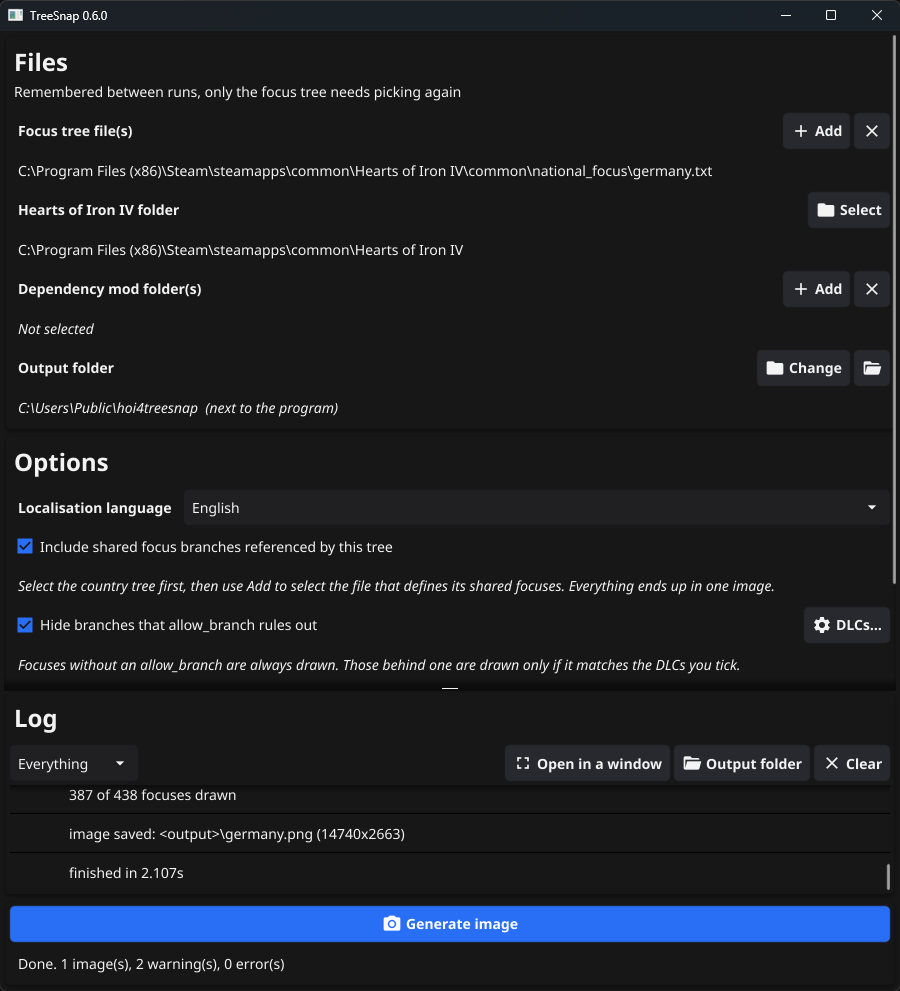

__hoi4treesnap__ generates Hearts of Iron IV focus tree screenshots.

The tool itself does not contain any textures and picks them up from the HOI4 base game or a mod that contains selected focus trees. That includes all focus tree graphics: focus icons, focus tree plaques, focus tree lines and fonts. `nationalfocusview.gui` is being parsed to pick on your changes to it, so the output image looks quite similar to what you see in the game, even a modded one.

This is a fork of [malashin/hoi4treesnap](https://github.com/malashin/hoi4treesnap) with a rewritten parser, shared focus support and a reworked window. See [What is different in this fork](#what-is-different-in-this-fork).

### How to use:
1. Download and run the latest `hoi4treesnap.exe`.
2. Select focus tree file from `/common/national_focus`.
3. Select Hearts of Iron IV game folder.
4. If you need other mods, dependencies for example, add those.
5. Pick a localisation language if you do not want English. The list is the ten languages the base game ships.
6. Press `Generate image`. Output is saved next to the binary unless you pick another output folder.

Every selection is saved to `hoi4treesnap.json` next to the binary, so after the first run only the focus tree has to be picked again. The window always shows which folders are currently selected.

### What is different in this fork

* **New script parser.** The old grammar based parser refused files containing `>=`, `<=`, `!=`, `?=`, unquoted paths with `/`, `|` inside values, inline math in `@[ ... ]` or bracketed loc commands, and gave up on the whole tree when it met one. The parser is now hand written, understands all of those, and reports what it could not read instead of stopping.
* **Coloured focus names.** `§Y...§!` colour codes in localisation are drawn in the right colour instead of appearing as literal characters in the middle of the name.
* **Scripted localisation.** A title such as `Join the [GetSovietFactionForFinland]` now resolves to `Join the Comintern` rather than printing the command. The unconditional entry of the `defined_text` is used, which is the base wording the focus falls back to in game.
* **Shared focus trees.** A country tree that references `shared_focus = SOME_ID` gets that branch drawn into the same image, in the position that branch has for that country. With the option on, the file button turns into `Add`: pick the country tree first, then add the file that defines its shared focuses, and everything lands in one image. Turn the option off to get one image per selected file, as before.
* **allow_branch and DLCs.** `Hide branches that allow_branch rules out` decides whether hidden branches are filtered at all, and the `DLCs...` button next to it says which DLCs count as owned. A branch behind `has_dlc` is drawn only when that DLC is ticked, and a branch meant for players without it is drawn when it is not. Conditions that cannot be decided without a country never hide anything. The list holds the DLCs that actually gate a focus branch, with their short names, and grows with anything a mod turns out to use.
* **A log you can read.** Warnings and errors are coloured, repeats are counted on one line rather than repeated, the game and mod folders are shortened to `<game>` and `<mod name>`, and a filter narrows it to warnings or errors. `Open in a window` moves the log out of the main window and gives the settings the whole height; closing that window puts it back.
* **Native file and folder pickers.** Folders are picked in the same explorer window as files instead of the old folder tree, the dialog belongs to the main window so it cannot end up behind it, and it no longer runs on the UI thread, which is what used to leave the window unable to close while a picker was open.
* **Nothing stops the run.** Missing sprites, unreadable textures, missing localisation, broken coordinates and font problems are logged and the image is still produced. The log is shown in the window and written to `hoi4treesnap.log` next to the output.
* **Faster.** Textures are decoded once instead of once per focus, files are parsed in parallel, and the localisation scan no longer walks every key for every file. A full vanilla Germany tree takes about two seconds.
* **Mod icons that used to be blank.** DXT textures whose size is not a multiple of four (very common in mods, e.g. 94x82) are decoded instead of being rejected.
* **Dynamic icons.** `icon = { GFX_a = { trigger } GFX_b = yes }` picks the unconditional icon instead of drawing the unknown goal placeholder.
* **Remembered settings and a reworked window** with the current selections, an output folder, a language picker and a live log.

### Possible issues:
* The parser reports lines it could not read. Vanilla itself has a few, for example `interface/powerbalanceview.gfx` is missing its final `}`; those warnings are harmless.

### Known issues:
* There is no country name in the image.
* Conditional `offset = { ... }` blocks on a focus are ignored, the base coordinates are used.

### Building

Requires Go and a C compiler (Fyne needs cgo on Windows).

```
go build -ldflags "-H=windowsgui -s -w" -o hoi4treesnap.exe .
```

Tests that need a real installation are skipped unless `HOI4_PATH` is set:

```
go test .
```

### Menu:


### Output examples:


